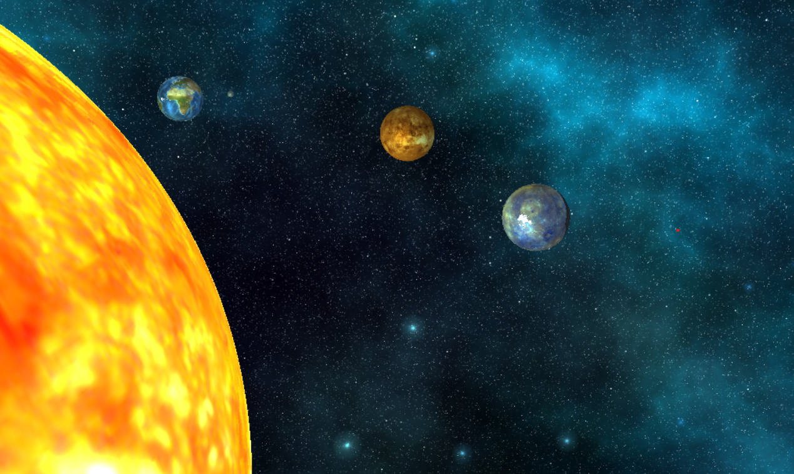
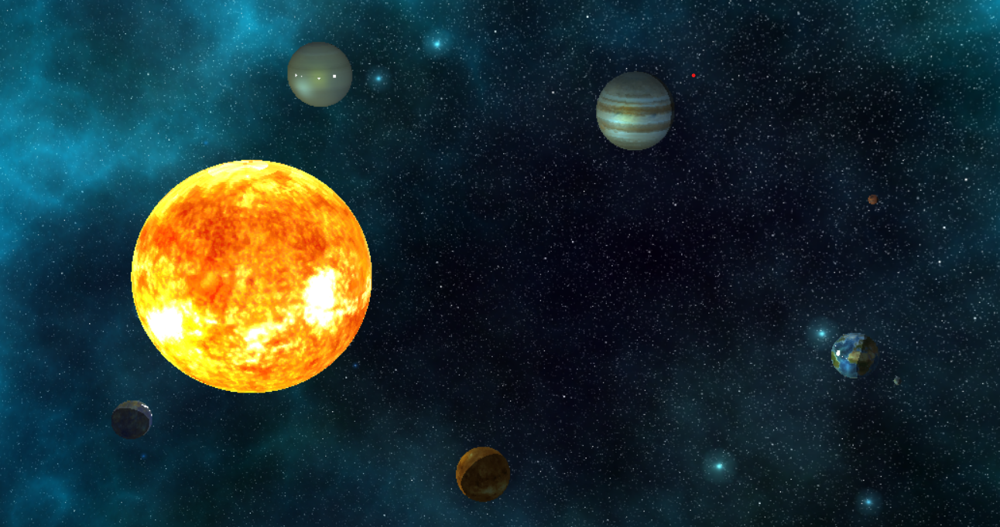
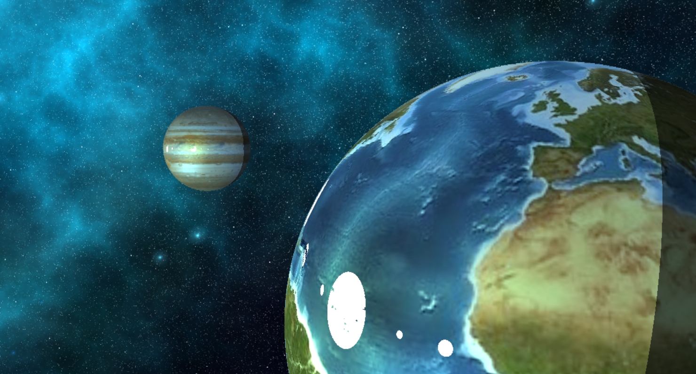
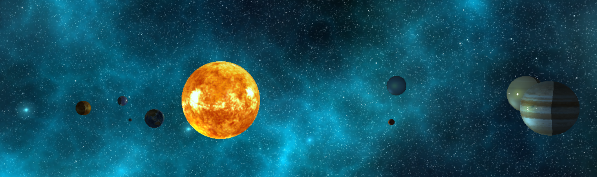
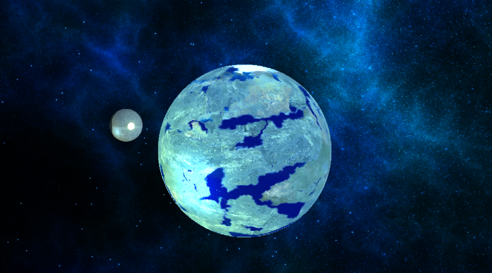
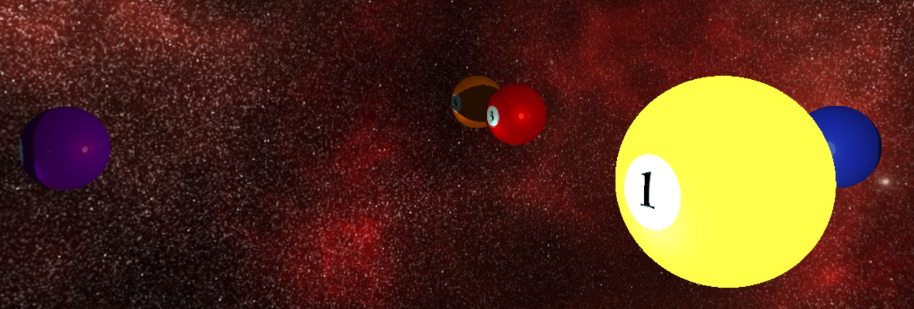
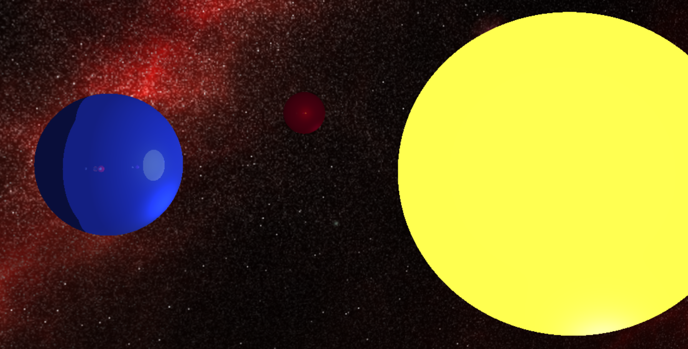

# Raytracing
## Short description
**Raytracing** is a real-time recursive ray tracing application created using OpenGL, featuring: 
- dynamic scene rendering
- fragment shader ray tracing
- camera control
- lightning and shading
- recursive reflections
- texture mapping

## First scene

## Second scene

## Third scene

